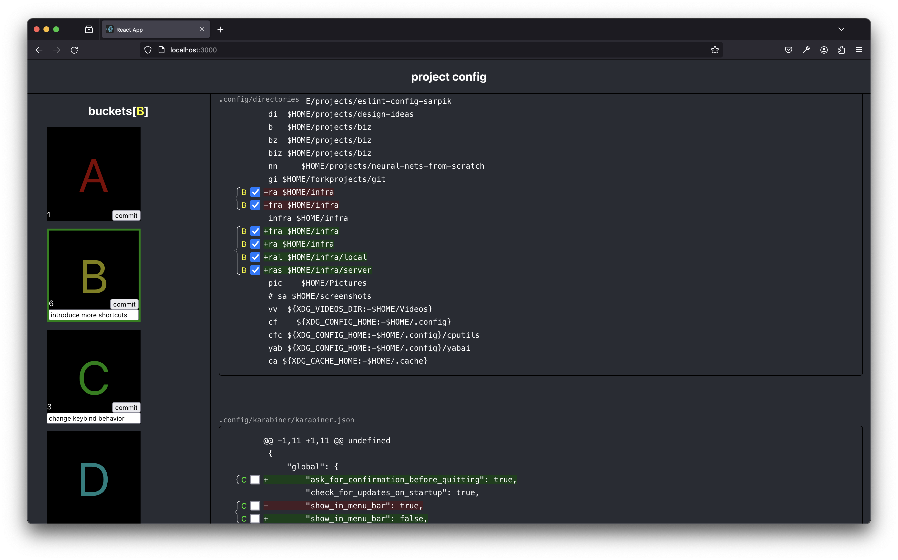

# git-add-buckets

	</img>
	

		Interactively add lines for creating multiple different commits, with ease & maximum precision.
	

## Implementation

Works by introducing an intermediate step to `git add -e` -- we use a fake
editor to get the output of the aforementioned command, present it to you in a
convenient web interface, and once you're done, we use a fake editor again to
give the adjusted content to `git add -e`.
